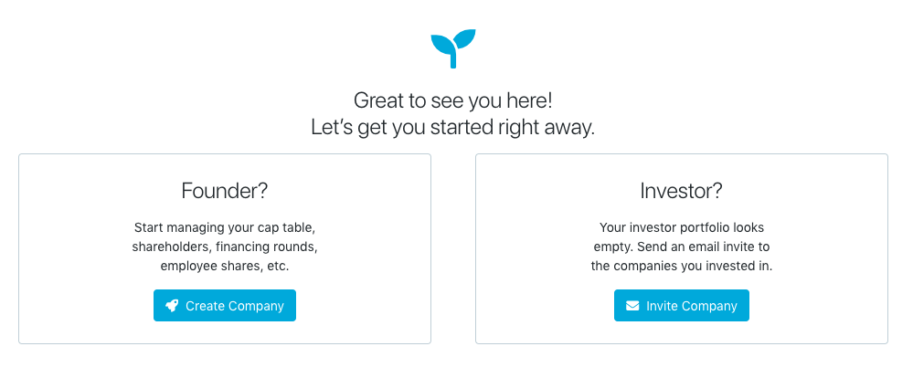
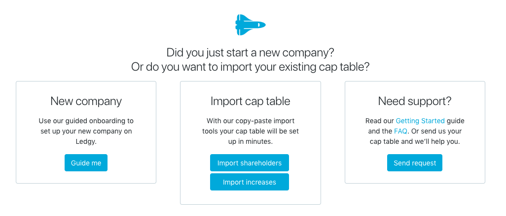
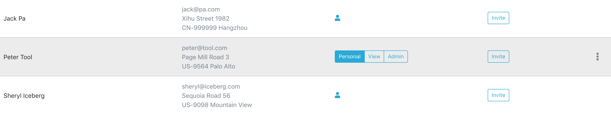
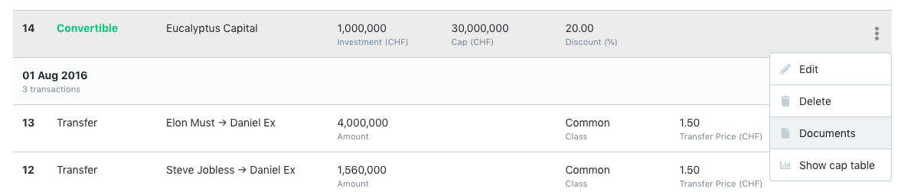

When you first sign up on Ledgy you will see this screen:

To create a cap table click on _Create company_. This will then lead you to a welcome screen:

The easiest way is to follow our onboarding by clicking on the _Guide me_ button (you can still return to the welcome screen at any time). Is anything unclear to you? Check our [FAQ](/help/faq/) and if you can’t find an answer there, just [let us know](/contact/)!

Alternatively, you can enter shareholders and transaction on the respective pages to set up your cap table or use the import tools.

#### The basics

If you choose not to use the onboarding steps above, here are the basics of how to use Ledgy.

##### Add new shareholders

- Go to the _Stakeholders_ page and add shareholders with or without an email address. If you add them with an email, they won’t be notified yet: you need to invite them explicitly to Ledgy (see next paragraph). However, if they already have an account on Ledgy with this email address, they will be able to see their stake in their portfolio.
- Change access level: If the shareholder has an email address, they can see their investment in their portfolio. You can easily give them view-only or admin rights with a single click. If they’re already on Ledgy they’ll be notified. If they’re not, you have to click _Invite_, see next point.
- Invite stakeholders: You can invite the shareholders that you’ve added with an email address to join Ledgy. Simply click on the invite button. You can see who already registered on Ledgy if they have a check mark instead of the invite button.

##### Add new transactions

- Got to the transactions page.
- Click on _Add Transactions_ and choose the transaction you’d like to add. Fill in the required details and click on save.
- Once the transaction appears in the transactions list, you can also __attach the corresponding documents__ such as a legal contract:

- Once you are done with adding all new transactions click on the _Commit_ button (read on to find out why).

##### Commit your draft

All the new transactions you’ve added will be saved as your new draft. Once you are done with adding them and are happy with it, you can hit the _Commit_ button to save your draft as your official transactions list. Don’t worry, you will be prompted to review your changes before confirming.

###### What does the _Commit_ button do?

1. Check if there are no errors and save the new transactions as the updated ownership history. Now you can do changes again and see the differences.
2. It makes the new information available for all your company’s shareholders who have an account on Ledgy. In other words, if your shareholders have an account on Ledgy and see your company in their portfolio (see next paragraph), they will see the up-to-date information about their stake as soon as you click on the _Commit_ button. They will not see any notes or documents added to the transactions.
3. Saving a PDF snapshot of your new cap table and transactions. This creates an audit trail for you for future due diligence. The snapshot is also certified by the [blockchain notary](/help/faq). Of course, you can delete this document if you don’t want it.

##### Have a look at your portfolio

- All users on Ledgy, including you if you own shares in a company on Ledgy, have a portfolio which shows your investments.
- In order to see your investments, the company has to add you as a shareholder with an email address and committed the transactions.
- To see your portfolio click on your name at the top right corner and select _Portfolio_.

Happy cap tabling!
