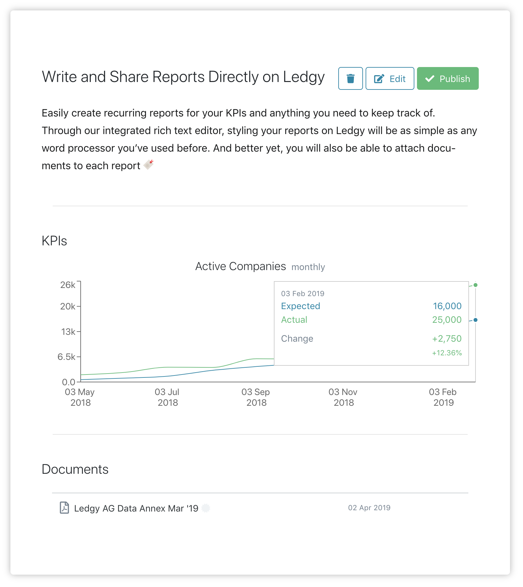

As a **startup founder**, or as its **investor**, you have most likely experienced the pain of constistently staying up to date with the company progress and its activities.

As a founder, you know how tedious it is to write recurrent reports, to keep up with KPIs, and to have to constantly inform all your stakeholders about it.

As an investor, you want to know how the company is doing at all times, and appreciate proper and transparent communication.

###### Suffer no more, Ledgy brings to you KPI tracking and recurring reports

What you can see above is an example of what a report looks like. With Ledgy Reports, you can also
* Create **templates** and use the same structure for every recurring report, which will save you time and keep your documents constistent
* **Share** the report with your selected stakeholders by clicking on *Publish*

###### Ready to try it out?

[Click here](https://app.ledgy.com) to go straight to the Ledgy app
