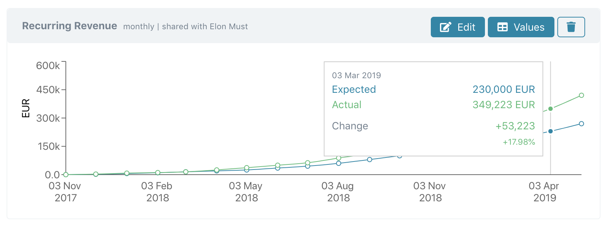
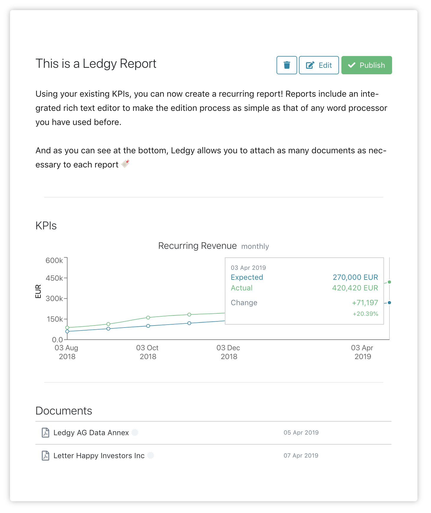

As a **startup founder**, or as its **investor**, you have most likely experienced the pain of consistently staying up to date with the company progress and its activities.

As a founder, you know how tedious it is to write recurrent reports, to keep up with KPIs, and to have to constantly inform all your stakeholders about it.

As an investor, you want to know how the company is doing at all times, and appreciate proper and transparent communication.

###### Suffer no more, Ledgy brings to you KPI tracking and recurring reports

 

Integrate your key performance indicator values on Ledgy in a matter of minutes, copying and pasting existing values if needed.

Ledgy will display beautiful graphs that you will be able to share with your investors and integrate into your reports.

 

You can track as many activities as you want, whether it’s revenue, planted trees, or rockets successfully landed on Mars.

**Once your KPIs are up and running, it will be time to implement your recurring reports** 🚀

The awesomeness doesn’t stop here. With Ledgy Reports, you can also
* Create **templates** and use the same structure for every recurring report, which will save you time and keep your documents consistent
* **Share** the report with your selected stakeholders by clicking on *Publish*

###### Ready to try it out?

[Click here](https://app.ledgy.com) to go straight to the Ledgy app

At Ledgy, we are always striving to thrive and bring the best solutions for your company and your investors. If you have any suggestions, don’t hesitate to ​[contact us​](mailto:contact@ledgy.com).